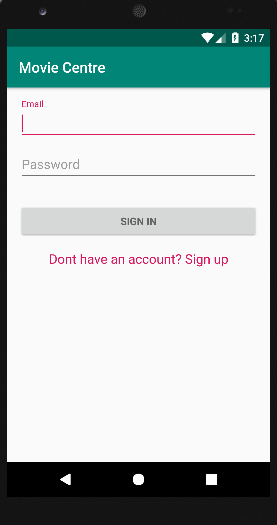
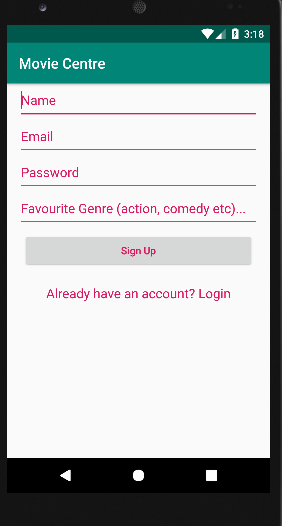

# Blog: Movie Centre

**Anas Alagtal**

## My First Blog Entry

I started the project after functional spec completion towards the end of semester 1 by messing around with android studio and familirising myself with its features and getting all the plugins, updates needed to begin my project.

## My Second Blog Entry

By the last week of the semester I had an empty UI application in android that connected to google's firebase which will be my database and server. I have not come across any difficulties to this point in my project but lack of knowledge of android studio is slowing me down.

## My Third Blog Entry

It is week 2 of semester 2 and I am currently working on getting the log in screen done for my application along with user authentication. It could take the whole week seeing as I have responsibilities for other modules to complete. Here is a simple screenshot of the UI for log in

## My Fourth Blog Entry College week 3

This weekend I completed user registration. I came across erros which would not allow my android application connect to firebase. It turned out to be different gradle versions that were not compatable with Firebase. I am now moving on to log ins and checking if a user is registered. Here is a screenshot of the registration Activity.

## My Fifth Blog Entry

This week i finished log in Authentication and started a tabbed acivity To accomadate the display of movies from "The movie DataBase". I am hoping to have that done by the end of the week if not next week seeing as we are working on a research paper assignment and studying for two CA exams in the 2 weeks.

## My sixth Blog Entry

This week I got started on pulling the "The movie DB" information through their API. I followed an online tutorial allowing http network requests by creating a NetworkRequest class.
I made a java class that read the Json information from The movie DB and pass it into a movie details list. I came across some errors again but the were regarding different gradle versions.
I fixed this by moving from SDK version 28 to 26 which is a solve i found on stack overflow.

## My seventh Blog Entry

I am now working on displaying the movie posters read from the Json into the UI. I createddifferent fragment classes for each of my tabs; "Upcoming movies", "Top Rated Movies", "Now Playing Movies" and "Recommended".
I got the movie posters for Up coming movies to show for movies to be released within the next 2 weeks. Any longer than 2 weeks and The movie DB seemed to not have posters for
any of those movies. I will be working on finishing the rest this week but i am held back due to an exam on Monday and a research paper due 3 days later.

## My eigth blog Entry

I managaed to compled displaying the posters. Was not showing it the way i intented until i found a tutorial for a column fitting method online which i used to be able to display 3
posters at one time. From then i also completed displaying remaining poster for movies in the other tabs i.e Popular and now playing movies.

## My ninth blog Entry

I started working on the recommender system and spent early a week on research and implementation. Because i decided to implement a content based recommender system there was no need for
machine learning. My system takes in a csv file of movies and their details along with a list of movies that the user rates highly as a parameter and returns a list of movies which the
system deems to be of relevance and possible interest to the user. I showed Alistair my program and he tested it for himself. The outputted movies that were a result of my system and his
choice of movies seemed to be of great relevance to him as he has watched and enjoyed some of the reslting movies as wel as finding those he didnt watch relevant.

## My tenth blog Entry

I am working displaying movie details at the moment. Once a user clicks on a sposter the user will be brought to a new page in the application displaying the name, poster, plot and other
details of the movie. As wel as that i need to be able to deploy my recommender system to a python framework to be able to call it from within android.

## My eleventh blog entry

I got the movie details class working but it is only displaying poster and plot for the time being. I went back to further work on the recommender python file. For testing purposes i was using a dataset containing 250 movies and their details. Now it now pulls all movie information from 'The movie Db' and stores that into a csv file. I chose to take the top 60 movies of each year since 1990 to be included in my dataset seeing as anymore and you start to get unrecogniseble movies. This also ensure users can get recommended movies that they have most likely heard of before so i can test the sucess of the application. My next step is to synchronise my android app with Firebase database to store user movie favourites to be used in the recommender system.

## My twelvth blog entry

I managed to connect android studio with firebase realtime database. I hard coded in a push request to add a movie to the table but it will now be simple to allow the users to push the movie to the table if they enjoyed it. I got a database.py file connecting to my firebase db also. This will be the file that calls the recommender.py file anytime the database is changed i.e. anytime the user updates his favourite movies list with a new movie. 

## My Thirteenth bog entry

After some research, I discovered the "Pyrebase" library that allows for triggers from firebase to call functions. As I already have the database.py connecting to firebase, I managed to get a method called anytime the favourite movie list is updated within the database by the user. I also ran my jsonInfo.py file to have write nearly 2000 movies and their details into the movies.csv file. The next step is to write the recommended list back into firebase.

## My fourteenth blog entry

I spent some more time today working on the front end. I implemented a rating bar to allow users to rate a movie they have watched. From there i connected the android applicaton to firebase so that anytime the user rates a movie 5/7 or higher the movie woud be pushed to firebase which would trigger the recommender system to recommend new movies. I also completed the last fragment wich was the popular tab. I also managed to get a movie details avtivity working for each movie in each of the three fragments

## My Fifteenth blog entry

When atempting to display the movies from firebase i run into errors. My android application can read the database and the movies stored under "Recommended" in a an ArrayList.However, when i try return that arraylist from the "OnDataChange" method it returns a null referance. I cant seem to figure out why. In the meantime I am soon to complete the questionnaire given to users after testing my application.

## My sixteenth blog Entry

In the last few days I completed the questionnaire that I will hand to users. I also fixed the erro that said i cant return a null reference in the "OnDataChange" method. I managwd to display the list of recommended movies and the next step is to integrate the movie details class on the recommended movie fragment.

## My seventeenth blog entry

I started testing. I did some UI tests and unit tests to see whether email is entered correctly, password entered correctly. Whether clicking different textviews or buttons bring you to where they are supposed to. 

## My eighteenth blog

Did some moe testing within android like covering the NetworkRequests class etc. Completed a few test on the python files, both the jsonInfo files by testing the dataframes and the API, and the recommender file by testing the dataframe functions. Further tests will be done but in the mean time i will need to study for exams.

## My nineteenth blog 

Once exams were finsihed i continued working on the technical spec and user manual. A testing document will also be done discussed some of the different test i completed. As of now i am finished the user manual and am a good bit into the technical spec. I have a meeting with Alistair later today to discuss the final touches odf my project366

## My twentieth blog

I had a final meeting with Alistair regarding my documentation and we talked about the demo and what I should prepare and expect. Today I completed the Technical spec. I will commit the spec tomorrow once I read through it one more time. All I have left now is the video walkthrough which should not take long.

## My twenty first Blog

I have now completed the walkthrough and all aspects of the project along with cleaning the code, adding/editing comments. Project is ready for marking.
